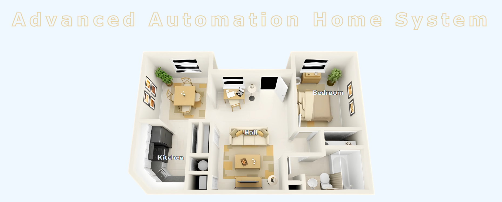
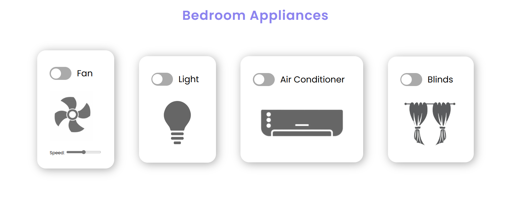

# 🏠 Home Automation Website 🏠

## 📝 Overview:

- The home automation project is an impressive web application that allows users to control home accessories such as fans, lights, and AC units remotely.
- The website provides a convenient interface for managing these devices, enhancing home comfort and energy efficiency.

## 🏠 Key Features:

- **User-Friendly Interface:** The website’s clean and intuitive design makes it easy for users to navigate and control their home accessories.
- **Real-Time Updates:** Devices respond promptly to user commands, ensuring a seamless experience.

## 🛠️ Installation:
#### Prerequisites:
- Install a code editor (e.g., Visual Studio Code, Sublime Text).
- Clone or download this repository.
#### Running Locally:
- Open `main.html` in your code editor.
- Use a live server extension (e.g., “Go Live” in VS Code) to view the website.

## 🖥️ Usage:
- Open the live server URL in your web browser.
- Explore the website:
    - Turn devices on/off.
    - Interact with buttons and controls.

## 🚀 Future Enhancements:
- Adding support for additional devices (e.g., smart plugs, thermostats).
- Integrating voice commands or scheduling features.
- Final Goal: Web Application along with a working hardware.

## 📸 Screenshots:

#### **Home Page:**

#### **Device Control Interface:**

